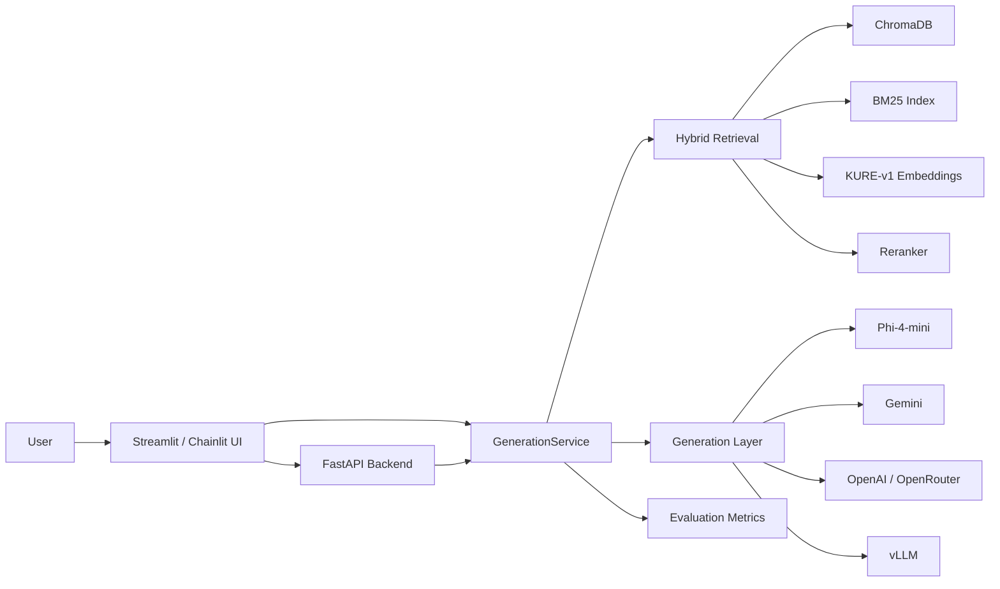

# 2Team_Project

[](https://www.python.org/)
[](https://streamlit.io/)
[](https://docs.chainlit.io/)
[](https://fastapi.tiangolo.com/)
[]()

> RFP document Q&A, retrieval, and model-switching utilities for the 2Team project.

## Overview

This repository contains a document-QA system built around a hybrid RAG pipeline and multiple LLM backends.
It includes:

- A Streamlit RAG dashboard
- A Chainlit chatbot UI
- A FastAPI backend for chat and evaluation
- Local and API-based LLM routing
- Retrieval using ChromaDB + BM25 + KURE-v1 embeddings
- PEFT notebooks for Gemma 4 fine-tuning
- Utilities for switching between Phi-4, Gemma 4, and vLLM workflows

The project is centered on RFP-style document analysis.

## Highlights

- Hybrid retrieval with dense + sparse search
- Query rewriting and metadata-aware routing
- Multiple providers: local Phi-4-mini, Gemini, OpenAI, OpenRouter
- Streamlit dashboards for chat and admin/analytics views
- Chainlit UI for a lightweight chat experience
- FastAPI endpoints for streaming chat, single-turn chat, and evaluation metrics
- vLLM switch scripts for model serving experiments
- PEFT training notebook for `google/gemma-4-E4B-it`

## Presentation Flow

This repository follows the same arc as the deck:

1. Data processing and chunk quality decisions
2. Retrieval and generation pipeline design
3. Evaluation set shaping and metric checks
4. Service deployment with Streamlit, Chainlit, and FastAPI

## Key Decisions

| Decision | Final choice | Why it matters |
| --- | --- | --- |
| Cleaning version | `v2` | Balances noise removal with context preservation |
| Chunking strategy | `fixed_1200_200` | Stable length, lower short-chunk ratio, better retrieval precision |
| Query routing | Dual retriever routing | Uses `kh_v3` for history-heavy Type C and `chunks_all` for Type A/B/D/E |
| Evaluation set | `1,100 -> 579` unique samples | Removes duplicates and groups tasks into A-E categories |
| Base runtime model | `Phi-4-mini-instruct` | Local fallback for runtime reliability |
| Training target | `gemma-4-E4B-it` | PEFT notebook target for larger-scale experimentation |

## Architecture



The diagram above reflects the main runtime path in the repository:

- UI layer: Streamlit, Chainlit
- Service layer: `GenerationService`
- Retrieval layer: ChromaDB, BM25, embeddings, reranking
- Generation layer: local and API-backed LLMs
- Evaluation layer: RAG metrics exposed by the FastAPI backend

## Screenshots

Add project screenshots under `docs/` and reference them here.

| Image | Purpose |
| --- | --- |
| `docs/streamlit-dashboard.png` | Main RAG dashboard |
| `docs/chainlit-chat.png` | Chainlit chat UI |
| `docs/api-metrics.png` | FastAPI evaluation or metrics output |

## Sections at a Glance

| Section | What it covers |
| --- | --- |
| Data Processing | Cleaning, chunking, metadata reconstruction |
| Retrieval and Generation | Hybrid retrieval, reranking, prompt routing, provider switching |
| Evaluation | Type-based eval set, faithfulness, relevancy, precision, recall |
| Service | Streamlit, Chainlit, FastAPI, vLLM |

## Verified Snapshot

These values are directly reflected in the notebooks and project scripts:

| Item | Value |
| --- | --- |
| Total chunks | 38,287 |
| Eval CSV files | 38 |
| Eval records | 1,100 |
| Training samples | 5,490 |
| Validation samples | 610 |
| Total samples | 6,100 |
| Chunk types | A: 328, B: 311, C: 143, D: 162, E: 156 |
| Default local model | `microsoft/Phi-4-mini-instruct` |
| Alternate model | `google/gemma-4-E4B-it` |
| Dense embedding model | `nlpai-lab/KURE-v1` |
| Reranker | `BAAI/bge-reranker-v2-m3` |

## Project Structure

| Path | Purpose |
| --- | --- |
| `main_py/` | Core retrieval, generation, API, and Streamlit app modules |
| `app.py` | Simple Gemini chat UI demo |
| `app_chainlit.py` | Chainlit chat UI |
| `main_py/web_rag.py` | Main Streamlit RAG dashboard |
| `main_py/web_rag_admin.py` | Admin/analytics dashboard |
| `main_py/web_rag_mobile.py` | Mobile-oriented UI |
| `main_py/fastapi_server.py` | FastAPI chat/evaluation backend |
| `main_py/retrieval.py` | Hybrid retrieval logic |
| `main_py/generation.py` | Prompting, routing, and generation logic |
| `main_py/service.py` | Service wrapper for retrieval + generation |
| `vLLM/` | vLLM serving and switching scripts |
| `switch_phi4.py`, `switch_gemma4.py` | Model-switching helpers |
| `Gunho/peft_gemma4_E4B_v2.ipynb` | Gemma 4 PEFT training notebook |
| `Gunho/budget_duration_reextract_v2.ipynb` | Chunk metadata rebuild notebook |

## Features

### Retrieval

- ChromaDB collections
- BM25 sparse retrieval
- Hybrid ranking and reranking
- Metadata filters for agency/year-style queries

### Generation

- Local fallback with Phi-4-mini
- Gemini and OpenAI-compatible API support
- Streamed answers
- Query rewriting for better retrieval

### Interfaces

- Streamlit RAG dashboard
- Chainlit conversational UI
- FastAPI endpoints for integration

### Training and serving

- Gemma 4 PEFT notebook with LoRA
- vLLM serving scripts
- Provider switching scripts for different deployment modes

## Results & Evaluation

The repository includes both training and analytics pieces. The FastAPI backend exposes evaluation-style metrics for RAG outputs:

- Faithfulness
- Answer Relevancy
- Context Precision
- Context Recall

The admin dashboard also tracks latency and retrieval metadata.

## How To Run

### 1. Install dependencies

```bash
pip install -r requirements.txt
```

### 2. Set environment variables

At minimum, configure the key required by the UI you are using:

- `GEMINI_API_KEY`
- `GOOGLE_API_KEY`
- `HF_TOKEN` for Hugging Face login in the Gemma notebook

### 3. Run an app

```bash
streamlit run main_py/web_rag.py
```

Other entry points:

```bash
streamlit run app.py
chainlit run app_chainlit.py -w
uvicorn main_py.fastapi_server:app --host 0.0.0.0 --port 2026
```

## Notebook Workflow

1. Inspect file structure and raw chunks
2. Normalize and rebuild chunk metadata
3. Apply cleaning v2 and chunking v2 decisions
4. Reindex ChromaDB and BM25
5. Build the 5,490 / 610 train-validation split
6. Fine-tune Gemma 4 with PEFT
7. Route queries with dual retrievers
8. Expose the system through Streamlit, Chainlit, and FastAPI

## Notes

- The repo mixes experiment code, runtime apps, and notebook workflows.
- Some paths are hardcoded for the `/mnt/gukrul` environment used in the notebooks.
- If you move the project to another machine, update the dataset and cache paths in `main_py/config.py` and the notebooks.

## License

No separate license file is included in the root snapshot here.

---

# 2Team_Project

[](https://www.python.org/)
[](https://streamlit.io/)
[](https://docs.chainlit.io/)
[](https://fastapi.tiangolo.com/)
[]()

> 2Team 프로젝트의 RFP 문서 질의응답, 검색, 모델 전환 도구 모음입니다.

## 개요

이 저장소는 하이브리드 RAG 파이프라인과 여러 LLM 백엔드를 묶은 문서 QA 시스템입니다.
구성 요소는 다음과 같습니다.

- Streamlit RAG 대시보드
- Chainlit 채팅 UI
- 채팅 및 평가용 FastAPI 백엔드
- 로컬/외부 API 기반 LLM 라우팅
- ChromaDB + BM25 + KURE-v1 기반 검색
- Gemma 4 PEFT 학습 노트북
- Phi-4, Gemma 4, vLLM 전환 스크립트

프로젝트는 RFP 형식 문서 분석에 맞춰져 있습니다.

## 핵심 기능

- dense + sparse 하이브리드 검색
- 질의 재작성 및 메타데이터 기반 라우팅
- 다양한 모델 공급자 지원: local Phi-4-mini, Gemini, OpenAI, OpenRouter
- Streamlit 대시보드
- Chainlit 채팅 UI
- FastAPI 스트리밍/단일턴/평가 API
- vLLM 서빙 전환 스크립트
- `google/gemma-4-E4B-it` PEFT 학습 노트북

## 검증된 스냅샷

노트북과 스크립트에서 직접 확인되는 값입니다.

| 항목 | 값 |
| --- | --- |
| 전체 청크 수 | 38,287 |
| eval CSV 수 | 38 |
| eval 레코드 | 1,100 |
| 학습 샘플 | 5,490 |
| 검증 샘플 | 610 |
| 전체 샘플 | 6,100 |
| 청크 타입 분포 | A: 328, B: 311, C: 143, D: 162, E: 156 |
| 기본 로컬 모델 | `microsoft/Phi-4-mini-instruct` |
| 대체 모델 | `google/gemma-4-E4B-it` |
| dense 임베딩 모델 | `nlpai-lab/KURE-v1` |
| reranker | `BAAI/bge-reranker-v2-m3` |

## 프로젝트 구조

| 경로 | 용도 |
| --- | --- |
| `main_py/` | 핵심 검색, 생성, API, Streamlit 모듈 |
| `app.py` | Gemini 채팅 UI 데모 |
| `app_chainlit.py` | Chainlit 채팅 UI |
| `main_py/web_rag.py` | 메인 Streamlit RAG 대시보드 |
| `main_py/web_rag_admin.py` | 관리자/분석 대시보드 |
| `main_py/web_rag_mobile.py` | 모바일용 UI |
| `main_py/fastapi_server.py` | FastAPI 백엔드 |
| `main_py/retrieval.py` | 하이브리드 검색 로직 |
| `main_py/generation.py` | 프롬프트/라우팅/생성 로직 |
| `main_py/service.py` | 검색 + 생성 서비스 래퍼 |
| `vLLM/` | vLLM 서빙 및 전환 스크립트 |
| `switch_phi4.py`, `switch_gemma4.py` | 모델 전환 스크립트 |
| `Gunho/peft_gemma4_E4B_v2.ipynb` | Gemma 4 PEFT 학습 노트북 |
| `Gunho/budget_duration_reextract_v2.ipynb` | 청크 메타데이터 재구성 노트북 |

## 실행 방법

### 1. 의존성 설치

```bash
pip install -r requirements.txt
```

### 2. 환경 변수 설정

사용하는 UI에 맞게 최소한 아래 키를 설정합니다.

- `GEMINI_API_KEY`
- `GOOGLE_API_KEY`
- `HF_TOKEN` - Gemma 노트북에서 Hugging Face 로그인용

### 3. 실행

```bash
streamlit run main_py/web_rag.py
```

다른 진입점:

```bash
streamlit run app.py
chainlit run app_chainlit.py -w
uvicorn main_py.fastapi_server:app --host 0.0.0.0 --port 2026
```

## 평가 포인트

FastAPI 백엔드는 RAG 출력에 대해 다음 평가 지표를 제공합니다.

- Faithfulness
- Answer Relevancy
- Context Precision
- Context Recall

관리자 대시보드에서는 지연 시간과 검색 메타데이터도 확인할 수 있습니다.

## 메모

- 이 저장소는 실험 코드, 런타임 앱, 노트북 워크플로를 함께 담고 있습니다.
- 노트북의 일부 경로는 `/mnt/gukrul` 환경 기준으로 고정되어 있습니다.
- 다른 PC로 옮길 경우 `main_py/config.py`와 노트북의 데이터/캐시 경로를 수정해야 합니다.

## 라이선스

이 스냅샷에는 별도 라이선스 파일이 포함되어 있지 않습니다.
